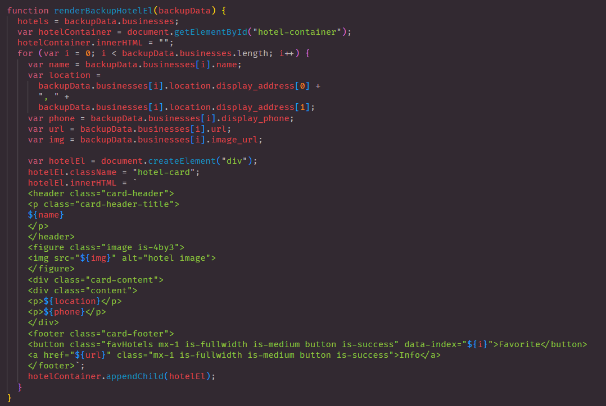

# Hotels-On-Demand

## Description

This application will help the user that is traveling find a hotel for their desired location. This application will also allow the user to see what the best food options are near that hotel. For this application we incorporated two API's with one used to find a hotel by city and the second used to find nearby resturants to that hotel. The user will be able to find where they can stay and where they can eat in this one application.

## Usage

The user will be able to use the application to find a hotel in the city they are traveling too. They will also be able to see what resturants there are around that hotel. This will make it easier for the user to know places they can eat when traveling as well as find a hotel that meets their needs. The user will be able to favorite possible choices to look back at later.

## License

Please refer to the LICENSE in the repo.

## Criteria for Project

GIVEN I am taking a trip I want to find the hotels by city and the resturants that are in the same area.

WHEN I am load the application THEN I am able to search by city and find a hotel I can use

WHEN I am presented with the list of hotels Then I am able to see the name of the hotel, a picture, the address and phone number for the hotel

WHEN I find a hotel THEN I am able to see the nearby resturants with the name, an address, picture, & phone number for that resturant

WHEN I find a resturant and/or hotel I want to try THEN I am able to favorite it and it is saved in local storage & on my favorites page

WHEN I click to the favorites page THEN I am able to see the hotels and resturants I have favorited and can remove them if needed

## Repository Link

[Github](https://github.com/thandyn/project-1)

## Website Link

[Hotels On Demand]()

## Screen Shots

This is our deployed website after searching up a city. On the left side will be list of hotels, and on the right side is a list of restaurants nearby the hotels. The favorite button will changed color and text when clicked on and the Info button will take the user to a different site to see reviews and more information. 

When user clicks on favorites in the nav bar, the user can see all that they have favorited. 

The first function that we wrote was to make our submit button fetch the two api we used. We used Travel Advisor and Yelp Fusion's api. The Yelp fusion was to fetch our hotel's information and our latitude and longitude. We took the latitude and longitude for Travel Advisor's api so we can find the nearest restaurants. 

This function is to render all of our restaurant's card. We noticed that not all restaurant included a picture and would show up as undefine on our page. We wrote an If statement that if it doesn't include a picture, it would use a placeholder image that we've provided. Another problem with this api is that for index 4 and index 11, it does not include restaurant's data but is for ad space instead and would show up as everything undefined. We used another If statement to skip and continue after index 4 and index 11. 

Same as the previous function, this was used to render all hotel cards. 

We had a backup data to render our Hotel cards because the api we used was giving us a cor error. This is backup for when we present and cards will be showing regardless of having the error or not. 

These are two add event listeners we added to the favorite button. We had to write two for each restaurant and hotel. Both are very similar written code. 

These two function are used to remove favorites in the Favorites page. 

These code are very similar to our first two render functions in our index page. It does exactly the same. 

The wireframe that we created to base our page off of. 
